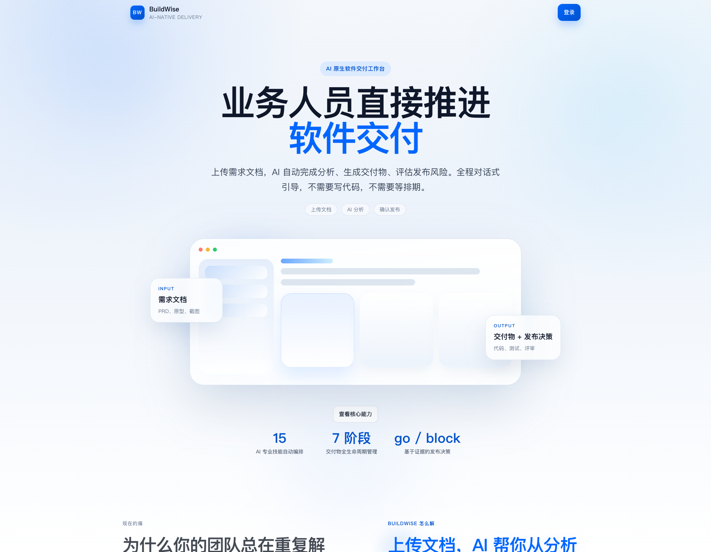
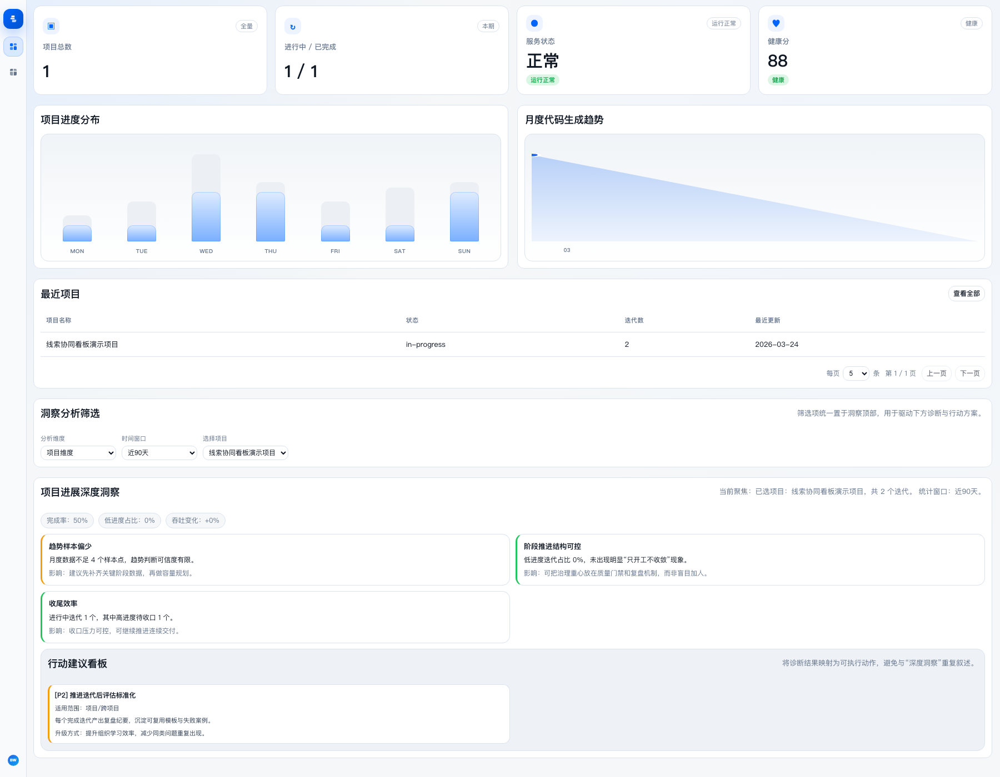
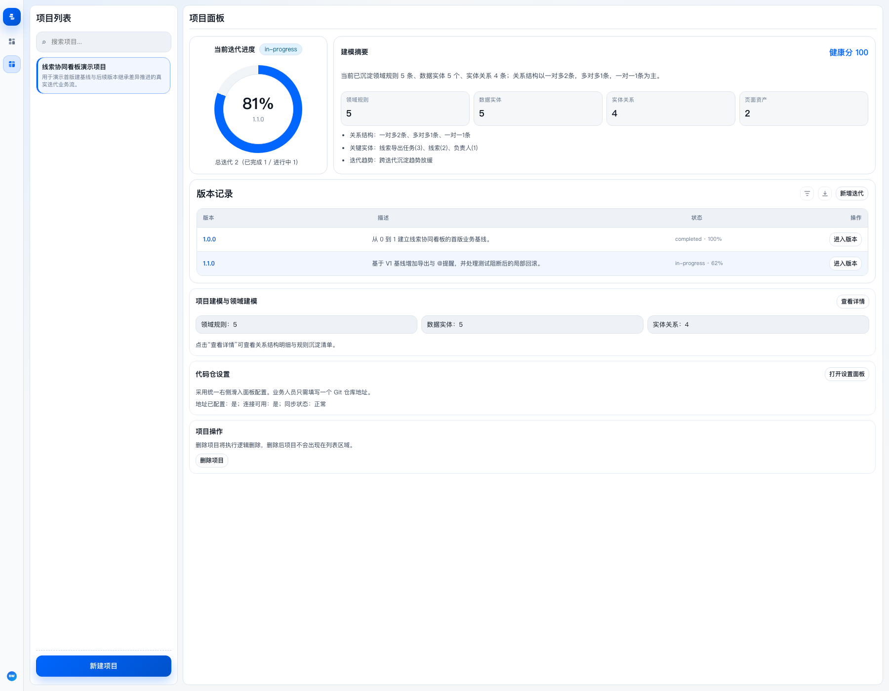
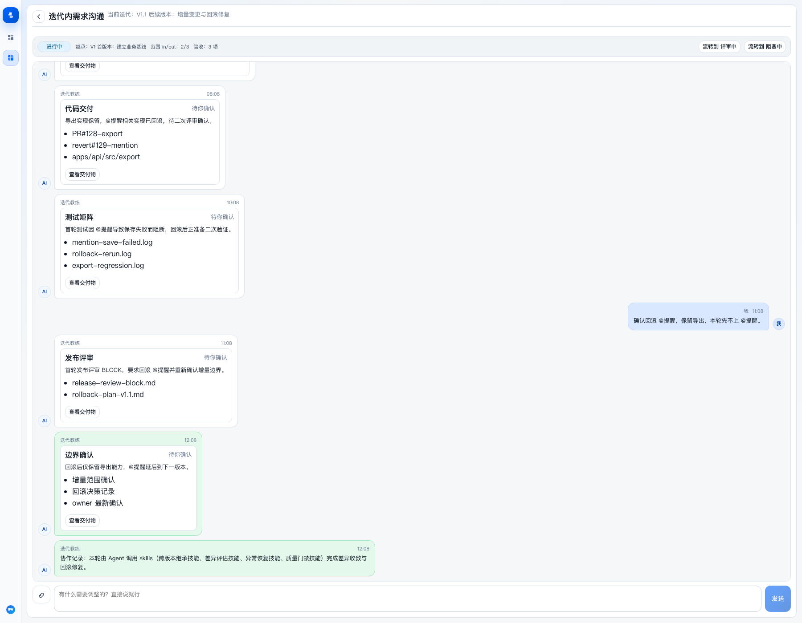
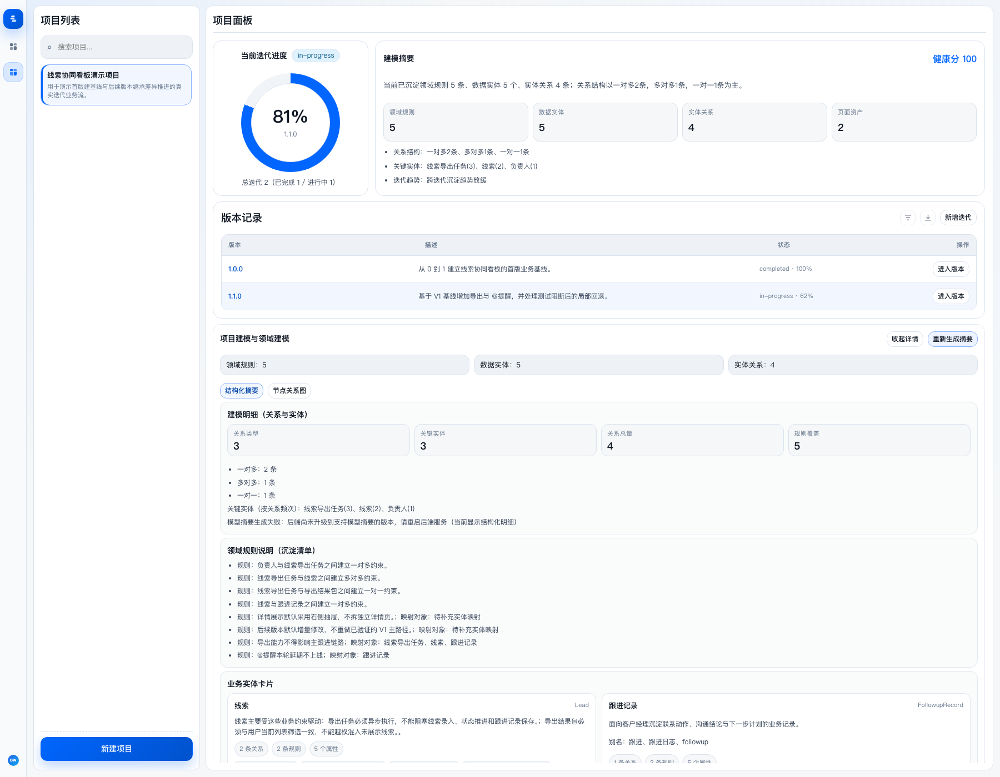

# BuildWise

> 把业务意图，编译成可执行的软件交付。

**语言 / Language:** [中文](README.md) | [English](README.en.md)

BuildWise 是一个面向产品经理、业务负责人、技术负责人和 QA 的 AI 原生交付工作台。
它不是把聊天框套进研发流程，而是把**需求分析、领域建模、交付物推进、测试验证、发布评审、项目知识沉淀**真正收进同一个项目空间。

## 它解决什么问题

大多数软件团队的问题不是「没人会写文档」，而是软件交付链路上长期断在三处：

- 需求改了，但没人知道影响了哪些页面、接口、规则和发布风险；
- 上线前没人敢回答「现在到底能不能发，凭什么发」；
- 版本做了一轮又一轮，规则、边界和历史决策散落在聊天、PRD、原型和代码里，团队又回到从头理解。

BuildWise 要补的，正是这条从「业务意图」到「工程落地」之间长期断裂的链路。

## 一句话理解

BuildWise 把「业务意图」编译成「可执行的软件交付流程」，并把每次迭代里的规则、边界、交付物和发布决策，持续沉淀成项目级知识系统。

## 你会立刻感受到什么

- 从「每个工具里重新解释一遍背景」到「AI 始终知道这个项目在做什么」——上下文零断裂；
- 从「每个项目从零开始」到「AI 主动提醒你过去踩过的坑」——越做越懂业务；
- 从「代码写完才发现需求没问清」到「每个阶段出口有门禁把关」——质量内建在过程里；
- 从「发布靠拍脑袋」到「基于边界、测试和证据给出 go / caution / block」——交付可追溯。

## 为什么它不是另一个 AI 工具

- 它面向的是完整交付过程，不是单轮生成；
- 它让业务人员持续参与规则建模，不是只在 PRD 阶段出现一次；
- 它把历史知识回写到项目 workspace，不把价值留在临时会话里；
- 它给发布决策提供边界、测试和证据，不只输出一段「看起来不错」的回答。

## 核心价值

### 1. 业务人员能直接推进软件交付

BuildWise 把「产品想法 → 需求澄清 → 交付物 → 测试 → 发布」做成一个工作台，而不是要求业务人员先学会研发过程语言。

### 2. 项目越做越懂业务 — 核心壁垒

每个项目都有独立 workspace，所有迭代持续回写到同一个项目知识空间，沉淀：业务术语、稳定规则、实体关系、页面/API/代码映射、决策日志、已知风险、变更模式。项目经验随版本累积，越用越聪明。

### 3. AI 参与治理，不只是生成内容

当前实现是 `Agent + Skills` 模式：AI 会根据当前阶段、项目知识和用户对话动态选择技能，而不是死板地跑固定流程。每个阶段出口有门禁把关，质量是过程保证，不是事后检查。

### 4. 发布决策不再靠拍脑袋 — 交付可追溯

每次迭代都会进入变更边界确认、测试矩阵、发布评审。系统会明确给出：现在可以发、谨慎发、还是必须阻断——每一行代码都能追溯到需求来源，每一次决策都有证据留存。

## 产品界面示意

这些截图展示 BuildWise 的产品表达方向与核心工作台形态。

### 1. 官网首屏



### 2. 仪表盘总览



### 3. 项目与交付全景



### 4. 需求到测试与发布决策



### 5. 项目建模与领域建模



## BuildWise 的工作方式

```text
主窗口配置默认策略
        ↓
每个项目绑定独立 workspace
        ↓
项目内创建迭代并上传需求材料
        ↓
AI 完成分析、澄清、边界收敛
        ↓
生成并推进交付物、测试和发布评审
        ↓
规则、本体、证据与决策回写项目知识库
```

这意味着：

- `Project` 是长期知识边界；
- `Iteration` 是项目内版本上下文；
- `Workspace` 是项目运行边界，不是临时会话容器。

## 适合谁

- **产品经理**：分析需求、确认边界、审核交付物；
- **技术负责人**：审查规则映射、影响范围、发布门禁；
- **QA**：执行测试矩阵、校验阻断项；
- **业务负责人**：查看项目全景、追问规则和风险。

不适合：只想做单轮内容生成、不需要交付链路与知识沉淀的轻量用户。

## 当前已落地能力

当前仓库不是概念稿，已经落成前后端一体的工作台。

### 项目空间

- 项目 / 迭代 / 交付物三层结构，项目级 workspace 隔离；
- 项目知识目录 `workspacePath/.buildwise/` 物化、分片和检索；
- 多租户硬隔离：DB 层 `tenant_id` 约束 + 查询层租户作用域 + owner 分支收敛。

### 双模式交付引擎

- **阶段化交付管道**：需求分析 → 澄清 → 边界收敛 → 交付物 → 测试矩阵 → 发布评审；
- **Agent 协作台**：单 Agent + 多项目 workspace + 项目知识上下文注入；
- 发布判断给出 `go / caution / block` 三态决策，证据可追溯。

### 领域建模

- 项目建模与统一项目模型（Project / Iteration / ChangeControl / KnowledgeBase / ReleaseReview）；
- 本体（continuous-modeling）：实体、规则、关系、约束的结构化沉淀；
- 图谱 diff 增量：新增节点高亮 + 增量合并刷新，本体随真实代码演进。

### 经验与知识沉淀

- 编码 agent 改动回流本体——代码改动自动回流 `codePaths`，本体随真实代码持续演进；
- 项目知识库持续回写：术语、规则、关系、决策日志、已知风险；
- 经验沉淀可分片检索，跨迭代复用。

### Agent 编排

- 可插拔 Agent 执行后端：通过适配器端口 + 注册表接入，主实现 ClaudeCodeCliAdapter，业务层不依赖具体框架；
- Agent 框架可切换：声明与运行时分离（适配器端口 + 注册表），更换框架不影响业务层；
- 真实 Claude CLI 适配已端到端验证（dryRun 实跑 + 契约测试）。

### 门禁与工程基础

- 门禁硬化：`policyGate` 硬阻断 + 统一后验层 + 绕过检测审计；
- 评审门禁：发布前须解决阻断评审，全部解决后才放行；
- DDD 四层 + TDD：domain 零外部依赖、单文件 ≤ 800 行、先写测试再实现；
- SQLite 存储（JSON backend 已废弃降级）、Docker Compose 一键部署。

## 技术栈

| 层 | 选型 |
|------|------|
| 后端 | Node.js 22 · Fastify 5 · TypeScript 5 · DDD 四层架构 |
| 数据 | SQLite（JSON backend 已废弃，传 `json` 静默降级为 sqlite）· 文件式 workspace 持久化 |
| 前端 | React 18 · TypeScript 5 · Vite 8 · Biome · Tiptap 富文本 |
| AI | 智谱 GLM 系列（与后端 `.env` 同源，分层调度） |
| Agent | 可插拔执行后端（适配器端口 + 注册表）· 主实现 ClaudeCodeCliAdapter |
| 治理 | `policyGate` 硬阻断 + 统一后验 + 绕过审计 · 6 项质检协议 · `verify:all` 聚合门禁 |
| 部署 | Docker Compose · Nginx · 非 root 运行 |

## 项目结构

```text
BuildWise/
├── v2/                          # 当前主实现（前后端一体）
│   ├── src/                     # 前端：React + Vite
│   │   ├── app/                 #   应用编排（AppController 上下文）
│   │   ├── pages/               #   页面（官网 / 登录 / 仪表盘 / 项目工作台）
│   │   ├── components/           #   UI 组件与交付物渲染
│   │   ├── contexts/             #   React Context
│   │   ├── hooks/                #   自定义 Hooks
│   │   ├── domain/               #   前端领域模型
│   │   ├── infrastructure/       #   API 客户端与运行时适配
│   │   └── shared/               #   共享工具
│   ├── backend/src/              # 后端：Fastify + TypeScript
│   │   ├── domain/               #   纯业务模型（零外部依赖，聚合根边界）
│   │   ├── application/          #   用例编排（调用 domain + infrastructure）
│   │   ├── infrastructure/       #   技术实现（DB / LLM / Agent 适配）
│   │   ├── interfaces/          #   入口适配（路由 / 契约校验）
│   │   └── shared/               #   共享工具
│   ├── scripts/                  # 质检、播种、运维脚本
│   ├── tests/                    # 前端单测
│   ├── docker-compose.yml        # 一体化编排
│   ├── Dockerfile / nginx.conf   # 镜像与反代
│   └── docs/                     # 演示与机制说明
├── docs/                        # 执行版产品与架构基线
│   └── versions/                 #   版本快照 + backlog（每版本归档）
├── CLAUDE.md                    # 工程规范（自动注入 Agent 上下文）
├── CONTRIBUTING.md               # 贡献与文档对齐规范
├── CHANGELOG.md                  # 变更日志
└── README.md                     # 对外定位与总览
```

## 快速启动

环境要求：Node.js `>= 22` · npm `>= 10`。

### 1. 安装依赖

```bash
cd v2
npm run install:all      # 前端 + 后端一次性安装
```

### 2. 启动联调栈

```bash
cd v2
npm run dev:stack:start  # 前端 + 后端同时拉起
```

### 3. 访问入口

- 官网：`http://localhost:5173/#/`
- 仪表盘：`http://localhost:5173/#/dashboard`
- 后端：`http://127.0.0.1:5055`

### 4. 准备演示数据（可选）

```bash
cd v2
npm run seed:agentic:flow   # 重建演示数据（含 1 项目 / 2 迭代 / 项目知识库）
```

## 上线前配置

后端从 `v2/backend/.env` 读取配置，生产必须逐项确认：

```bash
cd v2/backend
cp .env.production.example .env

# 鉴权（生产必填）
AUTH_MODE=jwt                       # 生产用 jwt，不要用 off
JWT_SECRET=<openssl rand -hex 32>   # 必须显式设置

# 网络与前端
CORS_ORIGINS=https://your-domain
VITE_API_BASE=https://your-api      # 前端显式指向后端

# 存储
STORAGE_BACKEND=sqlite              # JSON backend 已废弃，传 json 会被静默降级

# 每个项目绑定独立 workspacePath（绝对路径），.buildwise/ 须可读写并纳入备份
```

受控发布验证：

```bash
cd v2/backend
npm run verify:prod-release   # 含 verify:prod-readiness + 契约验证
```

## 常用命令

```bash
cd v2
npm run dev:stack:start              # 启动前后端联调栈
npm run dev:stack:stop               # 停止联调栈
npm run dev                          # 仅启动前端
npm run build:all                    # 前后端一起构建

npm run verify:all                   # 聚合门禁（卫生/lint/边界/版本/typecheck/build/test/就绪/后端投产）
cd backend && npm run dev            # 仅启动后端
cd backend && npm run test:contract  # 契约测试（in-process + 子进程双模式）

npm run seed:agentic:flow            # 重建演示数据
npm run reset:business-env           # 恢复干净可投产初始业务环境
npm run clean:workspace              # 清空 workspace 运行时产物
```

## 质量门禁

```bash
cd v2
npm run verify:all              # 前后端聚合校验

cd v2/backend
npm run verify:prod-readiness   # 后端投产门禁
```

说明：

- `verify:all` 是前后端聚合校验（卫生 / lint / 边界 / 版本纪律 / typecheck / build / test / 就绪报告 / 后端投产）；
- `verify:prod-readiness` 是后端投产门禁，含契约测试；
- 当前分支已通过本地发布候选门禁，但最终生产放行仍取决于生产配置、SQLite 链路与部署环境校验。

## 当前状态

当前 `main` 分支可以视为**可受控投产候选**：

- 核心边界门禁、构建、类型检查和 contract 已通过；
- 项目级 workspace 隔离、项目知识目录和可插拔 Agent 执行后端已经落地；
- 运行时语义、健康检查、就绪检查、鉴权默认行为和文档口径已经收口。

这并不意味着「可以跳过上线流程」。真正放生产前，仍需按后端生产文档确认 `AUTH_MODE=jwt`、`JWT_SECRET`、`CORS_ORIGINS`、`VITE_API_BASE`、独立 `workspacePath` 与 `.buildwise/` 备份策略。

## 版本历程

版本以 `docs/versions/` 快照制归档，每版本归档前过 6 项质检协议且 `verify:all` 全绿。当前已归档至 v0.32.0，已激活 v0.33.0 占位（待立项）。

| 版本 | 里程碑 | 状态 |
|------|--------|------|
| v0.6.0–v0.6.1 | V1 — 迭代声明纪律建立 + Skill 死代码清理 | done |
| v0.7.0 | V2.1 — Agent 适配器抽象 + 注册表 | done |
| v0.8.0–v0.8.1 | V2.2 — ClaudeCodeCliAdapter + codeRewrite 异步化 + 编码 agent 接入 | done |
| v0.9.0 | V3 — 门禁 policyGate 硬阻断 + 统一后验层 | done |
| v0.10.0 | V4 — 领域模型/图谱持续沉淀 + 编码 agent 改动回流本体 | done |
| v0.11.0 | dryRun 真实链路实跑：ClaudeCodeCliAdapter 端到端可用 | done |
| v0.12.0 | 契约脚本重写：恢复生产门禁 verify:prod-release | done |
| v0.13.0 | 需求池版本归属交互优化 + 三道门禁加固 | done |
| v0.14.0–v0.16.0 | 流畅性架构债清理 + 体检待修收尾 + policyGate/双状态/changeImpact 集成 | done |
| v0.17.0–v0.19.0 | 多租户数据串修复 + 编排意图识别 + fullCycle 接真实 codingAgent/OpenHands | done |
| v0.20.0–v0.22.0 | 规范漂移校正 + 前端副作用单测 + owner 分支收敛重新设计 | done |
| v0.23.0 | 多租户 DB 层 tenant_id 硬隔离 | done |
| v0.24.0 | 突出核心价值，主线增量夯实（A 套元能力门禁激活） | done |
| v0.25.0 | 本体评审解决流程（评审门禁升级为发布前须解决阻断评审） | done |
| v0.26.0 | 遗留项统一收口（本体链 + 多租户 + 前端测试债） | done |
| v0.27.0 | 剩余技术债统一收口（回写正名 + 超限文件拆分 + Props Drilling 评估） | done |
| v0.28.0 | 剩余技术债清扫（analysisService 拆分 + biome-ignore 评估 + 前端超限 + 占位删除） | done |
| v0.29.0 | 目标端维度 MVP 闭环（发布评审按端聚合，门禁堵死「虚假 go」） | done |
| v0.30.0 | 按端质量数据 + LLM 按端评审（测试矩阵按端分组 + 代码路径按端白名单） | done |
| v0.31.0 | 按端展示端到端实跑验证（真实分析产出 perPlatform + 前端 DOM 测试） | done |
| v0.32.0 | 投产前卫生收口（后端 lint warnings 12→0 类型守卫替代 ! + DEPLOY.md 部署 runbook） | done |
| 后续专项 | v0.33.0 待立项（候选：前端 181 lint 清理 / synthesizeTestMatrixOp repair 循环 / 异步 full-cycle job） | planned |

## 文档导航

- 对外定位与总览：[README.md](./README.md)
- 前端 / 工作台运行与演示：[v2/README.md](./v2/README.md)
- 后端接口、环境变量与投产口径：[v2/backend/README.md](./v2/backend/README.md) · [v2/backend/docs/](./v2/backend/docs/)
- 文档索引与阅读顺序：[docs/README.md](./docs/README.md)
- 版本快照与 backlog：[docs/versions/](./docs/versions/)
- 工程规范（自动注入 Agent 上下文）：[CLAUDE.md](./CLAUDE.md)
- 贡献与文档对齐规范：[CONTRIBUTING.md](./CONTRIBUTING.md)
- 变更日志：[CHANGELOG.md](./CHANGELOG.md)

## 许可

[MIT](https://opensource.org/licenses/MIT)
