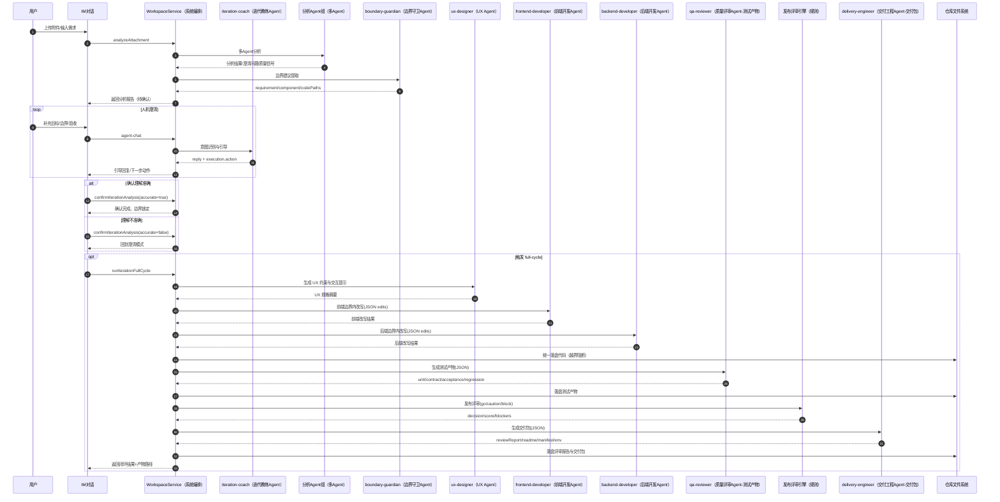
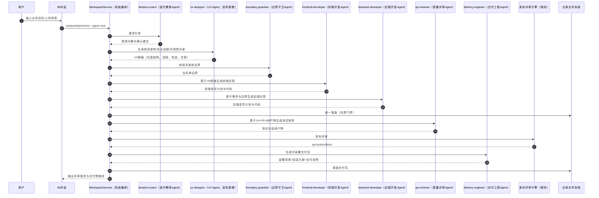

# IM与Agent协作执行时序图（现状与目标）

> 目的：沉淀 IM 场景下“人 + Agent”协作闭环，作为后续实现与对齐基准。

## 1. 当前实现时序图（As-Is）

## 2. 目标时序图（To-Be，显式 FE/BE + UX）

## 3. 节点映射（中文）

- `iteration-coach`：迭代教练Agent
- `boundary-guardian`：边界守卫Agent
- `frontend-developer`：前端开发Agent
- `backend-developer`：后端开发Agent
- `qa-reviewer`：质量评审Agent
- `delivery-engineer`：交付工程Agent
- `WorkspaceService`：系统编排层（非Agent）
- `发布评审引擎`：规则评审模块（非Agent）
- `仓库文件系统`：执行落盘模块（非Agent）
- `ux-designer`：UX Agent（已落地）

## 4. 关键实现定位（便于后续开发）

- IM 引导入口：`v2/backend/src/interfaces/http/routes/workspaceIterationCoreRoutes.ts`
- 教练Agent编排：`v2/backend/src/application/workspace/workspaceServiceCoachOps.ts`
- Full-cycle 主流程：`v2/backend/src/application/workspace/workspaceService.ts`
- 边界内改写：`v2/backend/src/application/workspace/workspaceServiceCodeRewriteOps.ts`
- 测试产物/交付包生成：`v2/backend/src/application/workspace/workspaceServiceQualityOps.ts`
- 边界确认与门禁：`v2/backend/src/application/workspace/workspaceServiceChangeControlOps.ts`

## 5. 当前与目标差距（摘要）

1. Full-cycle 已形成 UX 约束注入 + FE/BE 双泳道改写，并保留 delivery-engineer 兜底。
2. `ux-designer` 已在角色枚举、提示词与执行链中落地。
3. 测试产物与交付包支持 Agent 优先生成，并保留失败降级。
