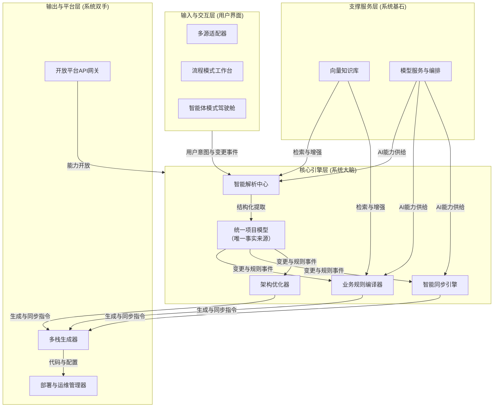
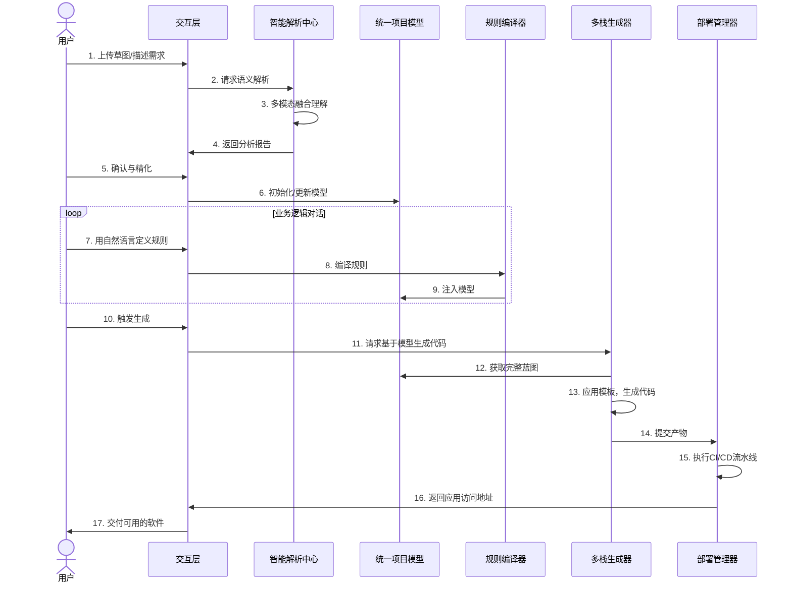
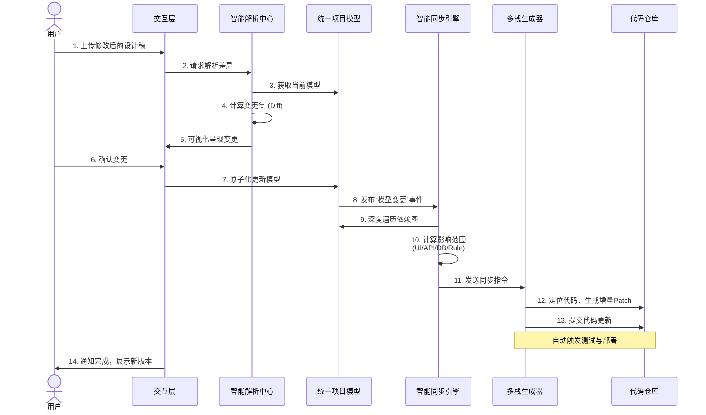

### **「构想智造」AI原生软件构建平台：完整产品顶层设计与落地节奏规划**

---

#### **一、 愿景、定位与核心主张**

**1.1 产品愿景**
成为数字创造时代的 **“业务意图操作系统”** 。我们致力于消除软件创造中“想”与“做”之间的巨大鸿沟，让任何拥有业务构想的人——无论其技术背景如何——都能像讲述需求一样，自然、流畅地构建出可运行、可演进的专业级软件应用。

**1.2 产品定位**
“构想智造”是全球首个 **“业务意图编译器”** 及 **“模型驱动的软件构建平台”** 。它颠覆了传统基于文档传递的“设计-开发”流程，通过一个动态的、结构化的 **“统一项目模型”** ，实现多模态业务输入与全栈软件输出之间的实时、双向、可追溯的编译与同步。

**1.3 核心价值主张**
*   **对非技术创造者（产品经理、创业者、业务专家）**：提供“数字杠杆”，实现 **“所想即所得”** 。将创意验证与初始版本构建周期从数月缩短至数日，极大降低试错成本，释放核心业务创造力。
*   **对技术与开发团队**：充当 **“精准无损的需求编译器”** 。将模糊、多变的需求直接固化为高质量、结构化的代码资产，彻底消除沟通漏斗，使工程师能专注于更具价值的复杂创新与性能优化。
*   **对企业组织**：构建 **“业务与技术的协同神经中枢”** 。提升数字化响应速度，保障软件资产与业务逻辑的高度一致性与可维护性，构筑长期数字竞争力。

---

#### **二、 市场洞见：为何是现在？为何是我们？**

**2.1 市场趋势交汇**
1.  **生产力平权**：生成式AI（尤其是代码生成）能力商品化，使“编写代码”的门槛迅速降低。
2.  **生产关系变革**：“一人公司”、微型创业与业务部门数字化需求爆发，“公民开发者”群体急需与其思维模式匹配的生产工具。
3.  **软件复杂度危机**：传统开发流程笨重、滞后，无法适应快速变化的市场需求，企业亟需提升软件构建的敏捷性与质量。

**2.2 竞争格局与战略空白**
现有市场解决方案存在结构性缺陷，留下关键战略空白：

| 维度 | **构想智造** | **传统低代码平台** | **AI编程助手 (Copilot)** | **AI黑盒生成器** |
| :--- | :--- | :--- | :--- | :--- |
| **哲学** | **“编译”业务意图**，人机协同构建。 | **“组装”预设模块**，在限定画布内创作。 | **“增强”开发者编码**，服务于专业程序员。 | **“生成”完整应用**，过程不可控。 |
| **输入** | **多模态**：语言、草图、设计稿、代码。 | **配置表单**与可视化拖拽。 | **代码上下文与注释**。 | **自然语言描述**。 |
| **核心** | **统一项目模型** (结构化数字蓝图)。 | **专有渲染引擎与运行时**。 | **大模型代码补全**。 | **端到端生成模型**。 |
| **输出** | **可维护、可扩展的全栈源代码** (用户拥有资产)。 | **平台锁定的黑盒应用**。 | **代码片段与建议**。 | **不可维护的黑盒应用**。 |
| **演进** | **模型驱动同步**，可持续迭代。 | **受限升级**，迁移成本高。 | **不涉及应用架构**。 | **推倒重来**。 |

**我们的机会**：创造一个兼具 **“极低使用门槛”**（对业务人员）和 **“极高输出质量”**（工业级代码）的新品类。**核心壁垒**将随着使用而不断加固：即通过“统一项目模型”积累的、跨行业的、结构化的 **“业务逻辑-代码模式”知识图谱**。

---

#### **三、 产品顶层设计：架构与核心流程**

**3.1 整体架构设计**
本产品采用基于领域驱动的分层微服务架构，以“统一项目模型”为数字核心，通过事件驱动实现松耦合、高内聚的协同。

**3.2 核心流程时序图**
**流程一：从多源输入到应用生成（核心正向流）**
此流程展示了用户将一个模糊想法变为可运行应用的全过程，体现了“编译”的核心能力。

**流程二：智能同步与迭代（核心反向流与价值闭环）**
此流程展示了产品最核心的差异化能力：当源头（设计、需求）变化时，系统如何智能、精准地同步整个应用。

---

#### **四、 产品规划落地节奏**

我们采用 **“内核锻造 → 智能扩展 → 平台生态”** 的渐进式演进策略，确保每一阶段都构建可验证的竞争壁垒。

##### **第一阶段：内核锻造期 (0-8个月) - MVP：验证“同步引擎”**
*   **目标**：打磨并验证 **“统一项目模型”** 与 **“智能同步引擎”** 的技术可行性，建立早期口碑。
*   **焦点场景**：**企业内部工具**（如数据管理后台）的快速生成与修改。
*   **核心交付**：
    1.  **多源输入**：支持Figma设计稿、手绘草图上传与解析。
    2.  **核心建模**：实现可视化项目模型编辑器，管理UI组件树与数据实体。
    3.  **基础规则**：通过对话定义字段与简单校验规则。
    4.  **王牌功能**：实现设计稿变更 → 模型更新 → **前后端代码自动同步** 的闭环，准确率要求100%。
*   **成功标志**：种子用户（技术产品经理）愿意在日常工作中使用本工具替代部分与开发的沟通。

##### **第二阶段：智能扩展期 (9-18个月) - V1.0：产品深化与市场切入**
*   **目标**：扩展模型表达能力，引入AI智能体作为协作者，支持复杂场景，实现产品市场匹配（PMF）。
*   **焦点场景**：**垂直行业解决方案**（如电商CRM、SaaS工具原型）的快速构建。
*   **核心交付**：
    1.  **复杂建模**：支持数据关联、状态机、用户权限。
    2.  **智能体协作**：实现目标驱动的规划智能体（如“帮我加个仪表盘”）。
    3.  **架构优化**：引入**DDD战术模式**推荐与代码自动化重构。
    4.  **团队功能**：项目协作、版本管理。
*   **成功标志**：付费客户数超过500家，形成2-3个优势垂直行业解决方案，智能体建议采纳率>60%。

##### **第三阶段：平台生态期 (19-36个月) - V2.0+：平台化与生态构建**
*   **目标**：将核心能力服务化，构建多角色协同平台与开发者生态，确立市场领导地位。
*   **焦点**：从“工具”演化为“平台”和“标准”。
*   **核心交付**：
    1.  **实时协同**：多角色（产品、设计、开发）在线实时协同工作空间。
    2.  **开放平台**：发布完整的开放API，允许第三方集成与扩展。
    3.  **生态市场**：上线“领域模板市场”与“智能体商店”。
    4.  **企业级能力**：提供组织治理、合规性检查、高级洞察等功能。
*   **成功标志**：建立活跃的第三方生态，与主流行业应用完成集成，成为中大型企业数字化工具箱中的标准配置。

---

#### **五、 总结**

“构想智造”所规划的，是一场对软件生产关系的系统性重构。我们不是简单地用AI替代某个环节，而是通过引入 **“统一项目模型”** 这一数字中枢，重新编织了从业务意图到软件实现的整个链路。

**我们的护城河将分三层构建**：短期内，是**可靠到极致的智能同步体验**；中期，是**积累在模型中的领域知识图谱**；长期，是**基于开放API构建的繁荣生态**。这条从“确定性内核”到“智能化涌现”再到“生态化繁荣”的路径，为我们提供了清晰、可控且充满巨大想象空间的成长蓝图。我们不仅是在打造一个产品，更是在为即将到来的、人机深度协同的创造新时代，铺设关键的基础设施。